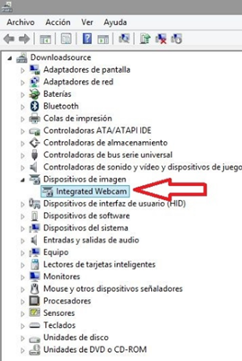

### Capítulo 1. Requisitos previos {#cap-tulo-1-requisitos-previos}

Con Hangouts Meet puedes realizar videollamadas con personas de tu dominio GSUITE o ajenas a él. Meet funciona en la mayoría de los dispositivos habituales PC de sobremesa, portátil, Tablet, smartphone…,y con los navegadores más comunes, debes tener el navegador actualizado a la última versión. Debes disponer de micrófono y cámara \(aunque si no dispones de cámara puedes hacer la videoconferencia utilizando solo el micrófono\).

Consulta en la tabla siguiente cual es el hardware y software compatible para utilizar Meet.

Recuerda que debes tener habilitados la cámara y el micrófono de tu PC para poder realizar una videollamada. Si tienes cámara web y micrófono pero Meet no los reconoce, ve al administrador de dispositivos de tu PC .

## AVISO: Deshabilitar la funcionalidad de Meet Acceso por Teléfono.

Conviene deshabilitar esta función para evitar sorpresas desagradables de facturación.

Para ello, el administrador de GSuite puede consultar en [este manual de ieducando](https://docs.google.com/document/d/1GkJKX4BJ15huTNfpV2_RYj_tDE0U3BOAhtMpv57DhM8/edit#heading=h.tp0n9dktg56b) para saber cómo hacerlo.
