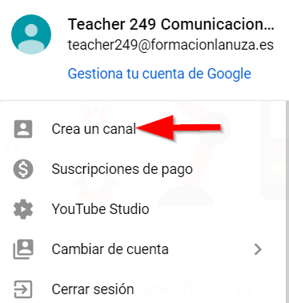
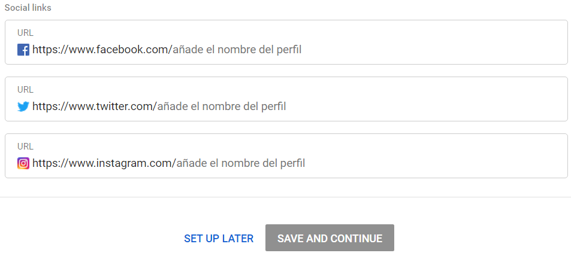

### Capítulo 1\. Crear y configurar un canal personal {#cap-tulo-1-crear-y-configurar-un-canal-personal}

Sigue estas instrucciones para crear un canal que solo tú puedas administrar desde tu cuenta de Google.

1.  Inicia sesión en YouTube en el ordenador o a través del sitio web para móviles.
2.  Para poder realizar cualquier acción, como subir un vídeo, publicar un comentario o crear una lista de reproducción, es necesario que crees tu canal.
3.  Pulsa sobre la opción Crea un canal como indica la siguiente imagen.
4.  

La primera vez que accedas te solicitará una serie de datos descriptivos del canal, si no quieres completar esta información, déjala en blanco y ve al final de la página y pulsa SET UP LATER

