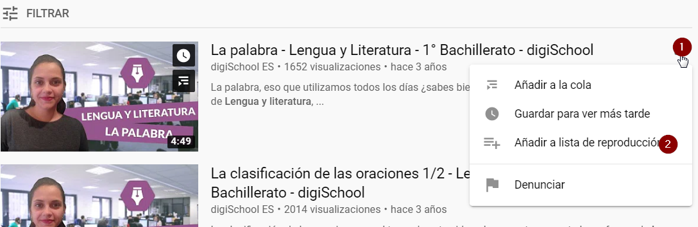

### Capítulo 2\. Organizar los vídeos, listas de reproducción: Youtube Studio {#cap-tulo-2-organizar-los-v-deos-listas-de-reproducci-n-youtube-studio}

Antes de empezar a subir vídeos es conveniente organizarlos bien por temáticas, aulas, niveles,... según la organización que prefieras para tus vídeos. Las listas de reproducción serán las que nos permitan realizar esta organización.

La gestión de listas, videos,... se realiza a través de **YouTube Studio**.

Una vez dentro de **YouTube Studio**, accederás a la siguiente pantalla:

Crearemos una lista de reproducción donde guardaremos los videos de una temática concreta, en el ejemplo crearemos una lista para guardar los videos tanto propios como de otros que encontremos en la red, relativos a la asignatura de Lengua de BACHILLERATO.

Escogeremos en la barra de la izquierda la opción Lista y crearemos una nueva lista. 

en la siguiente imagen puedes ver la diferencia entre  una lista pública, oculta y privada, se puede cambiar esta configuración siempre que se considera necesario.

Una vez **creada la lista puedes subir un vídeo**, por ejemplo alguno de los que hayas realizado con Hangouts  Meet, sigue los tres pasos que aparecen en la imagen

En el último paso, tienes opción de escoger que el video solo puedan verlo determinadas personas.

Una buena opción si no queremos que nuestros videos sean públicos o que puedan verse si cualquier persona tiene el enlace, es seleccionar la opción Privado y mostrarlo solo a los usuarios que escojamos. Para escoger los usuarios, una vez finalizados estos 3 pasos, seguiremos la configuración de la siguiente animación.

Según la imagen, solo el usuario teacher101@formacionlanuza.es podrá visualizar el vídeo.

Las listas de reproducción no solo tienen que estar formadas por vídeos que tú hayas creado, también puedes agregar vídeos que encuentres en YouTube, para ello, una vez localizado el video en youtube, se habilitarán los tres puntos típicos (paso 1) y después pulsa Añadir a lista de reproducción escogiendo la lista que te interese.( paso 2)

Finalmente, solo queda compartir tu lista de reproducción con tu alumnado. Recuerda que la lista estaba en modo oculto, eso quiere decir que solo las personas con el enlace de la lista pueden verla, y además hemos puesto dos vídeos, uno creado por nosotros mismos, privado que solo pueden verlo personas concreta, y otro que hemos escogido de youtube.

Para localizar el enlace de tu lista de reproducción y enviárselo a tus alumnos, profesores,... sigue el proceso de la imagen siguiente y al pulsar Compartir, obtendrás el enlace.

 

Esto el lo que verá una persona que acceda a la lista de reproducción pero no tenga acceso al video privado que hemos subido antes.

Hay muchas más opciones desde YouTube Studio, para subir videos, crear listas, borrar videos, ocultarlos hacerlos privados, permitir o no comentarios en tus videos ( ver imagen siguiente)

