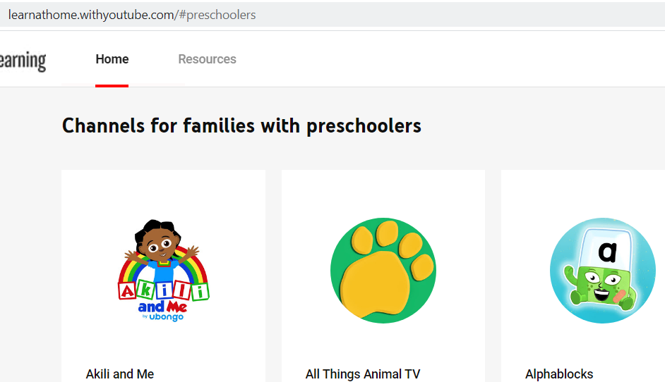
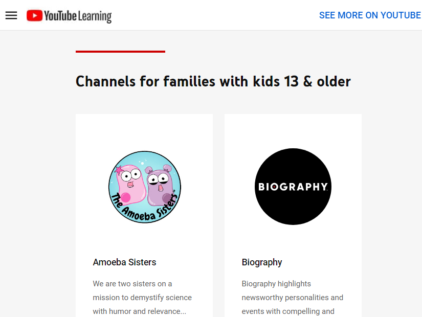
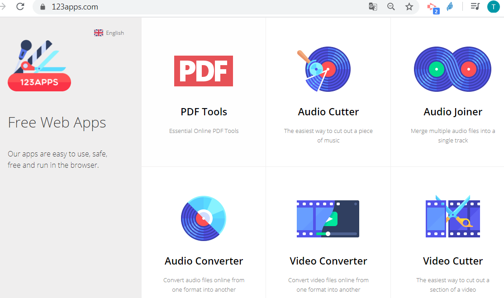
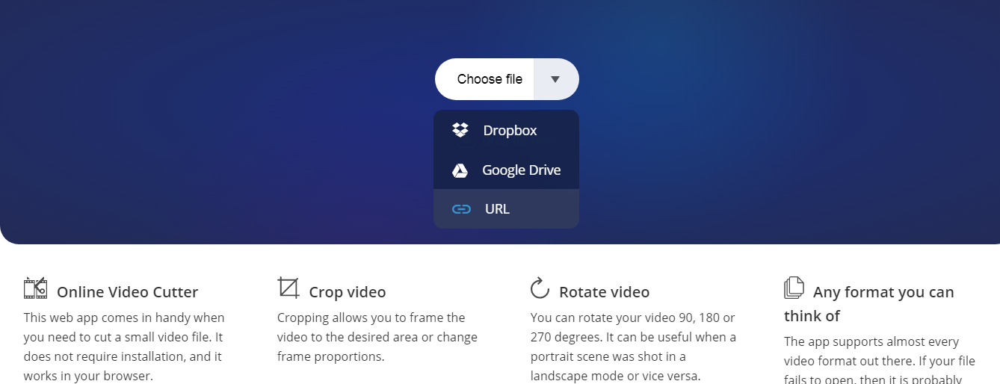

### Capítulo 3 . Canales educativos {#cap-tulo-3-canales-educativos}

Hay multitud de canales educativos tanto de una marca, editorial,... como de profesores concretos. Antes de recomendar un canal a tu alumnado, debes revisar sus vídeos, sobre todo cuando se trata de canales de personas particulares. Hay también canales reconocidos con una determinada “marca” cuya calidad no es la esperada, por lo que es necesario un proceso previo de verificación del contenido.

En la actual situación, Youtube ha lanzado una iniciativa ( de momento está solo en inglés) con recopilaciones de recursos para trabajar desde casa.

[https://learnathome.withyoutube.com/](https://www.google.com/url?q=https://learnathome.withyoutube.com/&sa=D&ust=1585136093924000)

Busca en internet los canales educativos que mejor se **adapten a tu modelo de enseñanza, área y nivel que impartes**. Hay multitud de herramientas online para tratar audio y video on line y así quedarte con la parte del vídeo que más te interese.

Por ejemplo en la web  [https://123apps.com/](https://www.google.com/url?q=https://123apps.com/&sa=D&ust=1585136093925000) hay un editor de video muy sencillo:

