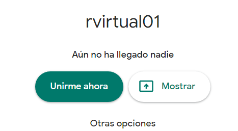
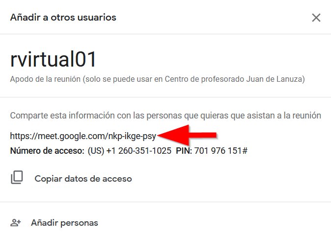
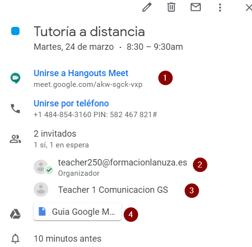
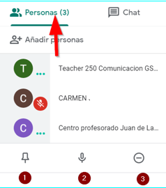
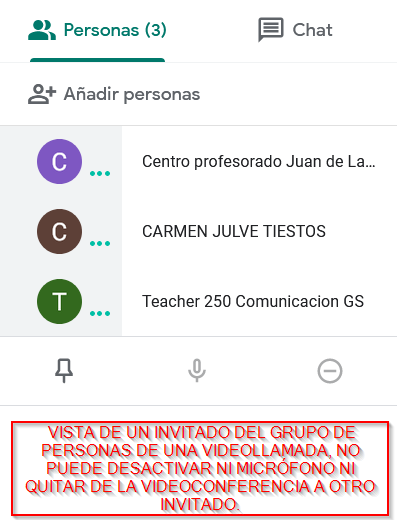
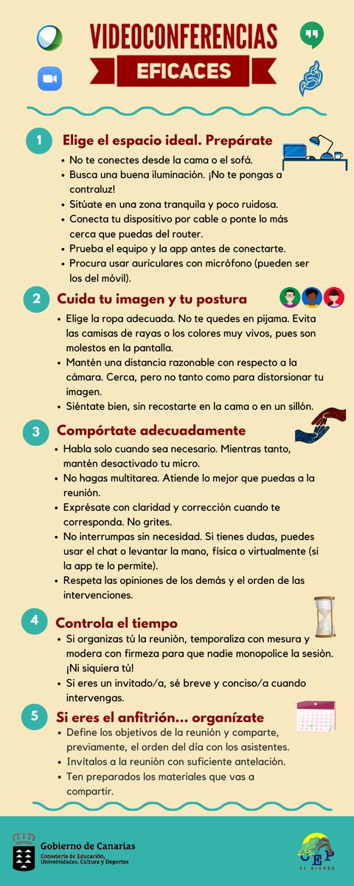

# 

### Capítulo 3\. Unirse a una videollamada. {#cap-tulo-3-unirse-a-una-videollamada}

#### 3.1 Unirse desde Meet introduciendo el apodo o nombre de la reunión. {#3-1-unirse-desde-meet-introduciendo-el-apodo-o-nombre-de-la-reuni-n}

Si accedemos a la videoconferencia desde una cuenta corporativa, solo necesitamos el nombre o apodo de la sala para unirnos a ella, de ahí que sea importante que el apodo no sea muy genérico como sala o reunion.

Logueados con nuestra cuenta corporativa, accedemos a meet.google.com y si conocemos el apodo de la sala, en este caso rvirtual01, accederemos a la misma pulsando en continuar y Unirme ahora.

#### 3.2 Unirse mediante la URL del enlace a la reunión {#3-2-unirse-mediante-la-url-del-enlace-a-la-reuni-n}

Cuando creamos una reunión, ésta tiene un enlace de acceso que podemos enviar por correo electrónico a las personas que deseemos y que tengan al menos una cuenta gmail ( no tiene porqué ser una cuenta corportativa)

Una vez hayamos recibido el correo con el enlace, basta con hacer clic en este enlace y seguir las instrucciones para unirte. Si intentas unirte a una reunión de otro Centro o no tienes una cuenta de Google, es posible que un participante de la reunión tenga que aprobar tu acceso.

#### 3.3 Unirse mediante un evento de calendario {#3-3-unirse-mediante-un-evento-de-calendario}

De cara a organizar la agenda de los asistentes a una videollamada, es muy aconsejable que el organizador cree un evento en calendar en el que incluya una videollamada sin más que pulsar en los detalles del evento, después agregará los invitados al evento incluyendo su correo electrónico, y automáticamente los invitados tendrán programado este evento en su calendario, cuando pulsen sobre el evento, basta con hacer clic en el enlace de la videollamad.

imagen de un evento de calendar con videoconferencia, el invitado, en este caso teacher1 solo tendrá que hacer clic en el enlace que aparece en la posición 1 de la figura.

Prueba desde Calendar a crear un evento e invitar a una persona mediante un evento de calendario en el que incluyas una videoconferencia. También pueden incluirse archivos adjuntos que podrán ser abiertos directamente desde la videoconferencia.

#### 3.4 Quitar invitados a una videollamada {#3-4-quitar-invitados-a-una-videollamada}

Para poder quitar a una persona invitada de una videollamada, debes pertenecer a la misma organización que la organizadora de la reunión.

1.  A la derecha, ve a Personas .
2.  Coloca el cursor sobre la persona que quieras y, a continuación, haz clic en la flecha hacia atrás .
3.  Haz clic en Quitar .

Personas de una conferencia vista desde la persona que la ha organizado. En el punto 3 puedes comprobar que puede quitar a una persona, pulsando sobre el micrófono, punto 2, puede silenciarla y pulsando sobre la chichet, punto 1, hace que su imagen se muestre ese invitado en la pantalla principal.

Esta es la vista de un invitado a una videoconferencia, no puede ni silenciar ni quitar a otro invitado de la sala.

Finalizamos este apartado con una infografía sobre Videoconferencias eficaces:

###  {#-0}

Infografía sobre el uso de videoconferencias de un colegio del Gobierno de Canarias.

