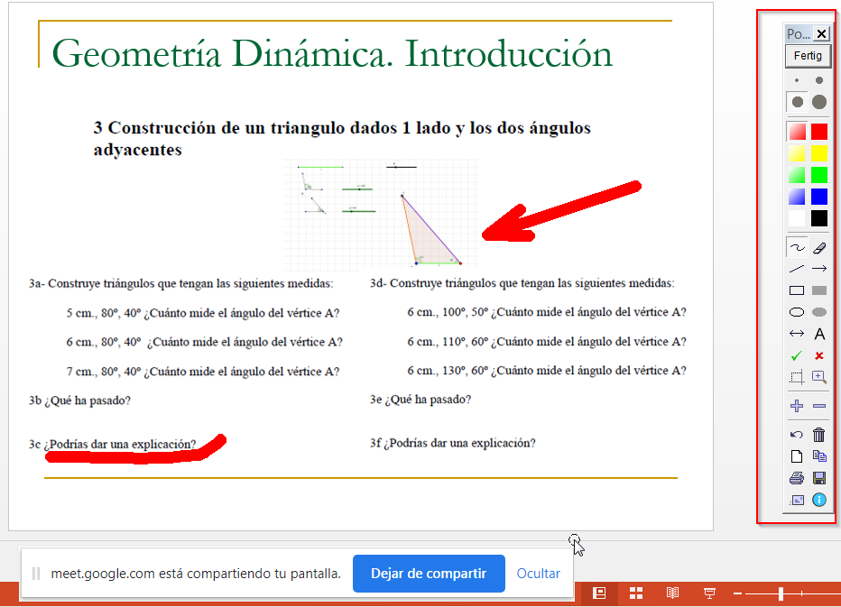
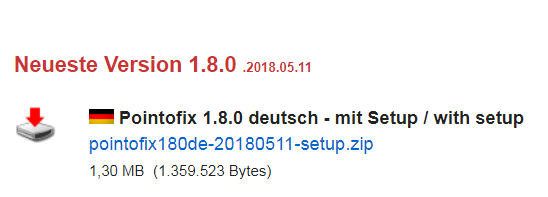

### Capítulo 5\. Complementos para una videoconferencia pizarra colaborativa Jamboard y aplicaciones adicionales. {#cap-tulo-5-complementos-para-una-videoconferencia-pizarra-colaborativa-jamboard-y-aplicaciones-adicionales}

*   Podemos utilizar Jamboard a modo de pizarra colaborativa, muy útil sobre todo si vas a realizar la videoconferencia a través de una tableta. Ver tutoriales

[Tutorial Jamboard](https://www.google.com/url?q=https://www.youtube.com/playlist?list%3DPLnVD0pPf7Gn9WgPQzy0F4_63l7_Jj9pnM&sa=D&ust=1585136093912000)

*   Una aplicación muy sencilla es **PointToFix**, permite superponer anotaciones y gráficos en cualquier momento y sobre cualquier aplicación, permite realizar zoom sobre la pantalla y resaltar zonas específicas de la misma. Es un buen complemento a tus exposiciones en videollamadas.

Por ejemplo, si queremos mostrar una presentación, imagen o documento durante la videoconferencia y superponer anotaciones sobre él durante la exposición, los pasos serían los siguientes:

1.  Desde la videoconferencia, compartir toda tu pantalla.
2.  Abrir la presentación o documento que queremos mostrar a los alumnos.
3.  Abrir la barra de herramientas PointToFix que vemos a la derecha. Podremos apoyar así nuestra presentación con Flechas, formas, trazo a mano alzada….

Podemos descargarla de la siguiente página [http://www.pointofix.de/download.php](https://www.google.com/url?q=http://www.pointofix.de/download.php&sa=D&ust=1585136093913000), aunque es posible descargar también el paquete de idioma para traducirla al castellano, la herramienta es muy intuitiva.

*   Por último, **si no tienes cámara web o deseas tener una cámara web que puedas colocar en diferentes posiciones, hay aplicaciones que permiten utilizar la cámara de tu móvil como una webcam**,  tienes más información en este  artículo [https://www.xatakandroid.com/tutoriales/como-usar-camara-tu-movil-android-como-webcam-para-tu-pc](https://www.google.com/url?q=https://www.xatakandroid.com/tutoriales/como-usar-camara-tu-movil-android-como-webcam-para-tu-pc&sa=D&ust=1585136093914000)