### Capítulo 2\. Crear una videollamada o reunión virtual {#cap-tulo-2-crear-una-videollamada-o-reuni-n-virtual}

Para poder crear una reunión virtual, debes disponer de una cuenta GSUITE. Hay varias opciones de crear una videollamada veamos las más comunes ( para dispositivos Android o iPhone tienes que descargar la app Meet )

#### 2.1 Iniciar videollamadas desde Meet {#2-1-iniciar-videollamadas-desde-meet}

1.  En un navegador web, accede a [https://meet.google.com](https://www.google.com/url?q=https://meet.google.com/&sa=D&ust=1585136093889000)  y logueate con tu cuenta GSUITE y haz clic en iniciar o unirse a una reunión.

 

1.  A continuación, elegimos el nombre que vamos a dar a la reunión que creemos, es importante, no poner nombres como “reunión” o “sala”, ya que este va a ser el identificador de la reunión y cualquier persona con cuenta de tu dominio podría entrar a esa reunión. En nuestro caso hemos creado una reunión llamada “rvirtual01”. Pulsa en continuar.

 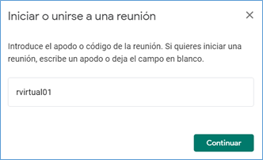

1.  Se iniciará la cámara y se activará el micrófono, pulsa en  Unirme ahora.

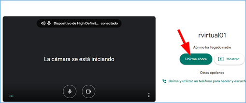

1.  Una vez dentro, para añadir a alguien a la reunión, puedes elegir una de las dos opciones:

*   O bien haz clic en Copiar datos de acceso   y pega la información de la reunión en un correo electrónico y envíalo a las personas integrantes de la reunión.
*   Otra opción es pulsar en Añadir personas   y en la sección Invitar, introducir las direcciones  dirección de correo electrónico de los integrantes de la reunión y pulsa en Enviar invitación.

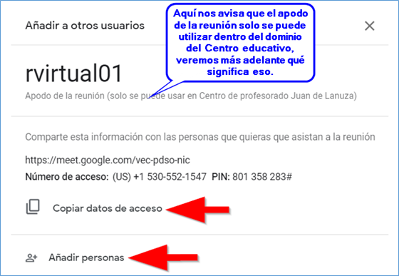 

1.  Si cerramos esta ventana, ya podemos hacer uso de la herramienta de conferencia, cuya interfaz similar a la herramienta Hangouts o a Skype.

Visualiza en la imagen el proceso completo y reprodúcelo en tu ordenador.

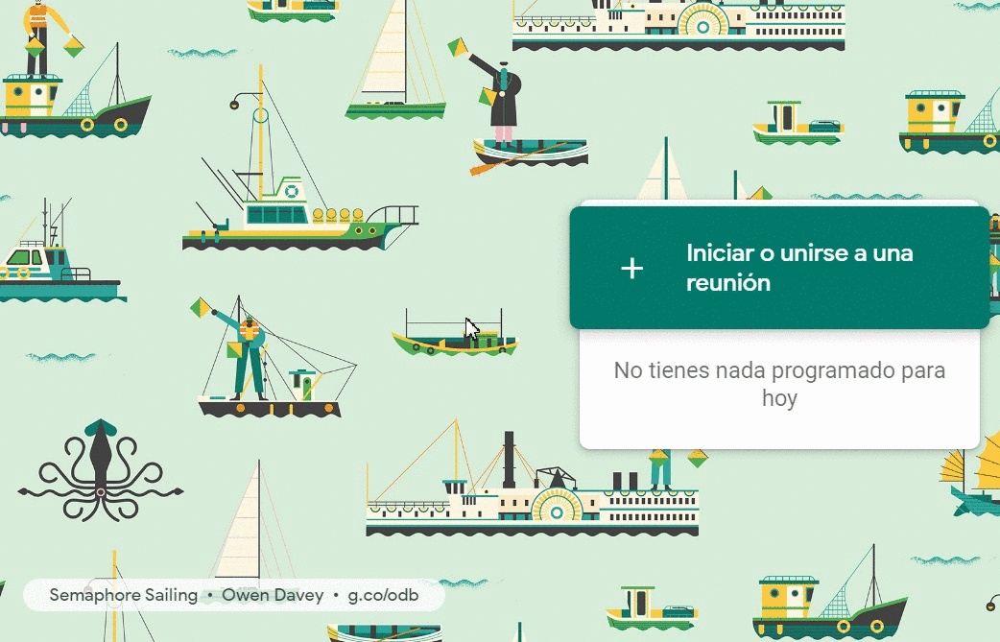

En la siguiente imagen puedes ver una videoconferencia con 4 participantes ( tres conexiones con una sola persona, y una conexión con un grupo de personas)

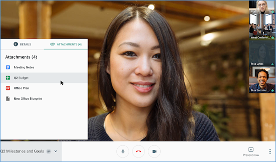

Fuente: [https://gsuiteupdates-es.googleblog.com/](https://www.google.com/url?q=https://gsuiteupdates-es.googleblog.com/&sa=D&ust=1585136093894000)

#### 2.2\. Controles de la sala virtual o videollamada {#2-2-controles-de-la-sala-virtual-o-videollamada}

Veamos el significado de cada uno de los botones que aparecen en la sala de videoconferencia.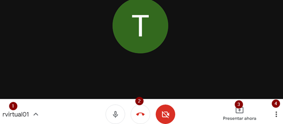 

1.  Apodo de la reunión, solo conocido dentro del dominio del Centro, de esta forma, alguien con una cuenta que no perteneciera al dominio, no podría entrar en la sala aunque conociese el apodo.
2.  Botón de control de micrófono, colgar la videollamada, y control de la cámara..
3.  Botón Presentar ahora, que permite proyectar nuestra pantalla, o algunas ventanas abiertas en nuestro equipo al resto de los participantes de la reunión.
4.  Los 3 puntos típicos de aplicaciones Google, tenemos el menú general, donde se nos permite activar la grabación de la reunión, cambiar el diseño, activar la pantalla completa, activar subtítulos (sólo en inglés), acceder a la configuración de micrófono y cámara, y los apartados de ayuda.

#### 2.3 Opciones de la videollamada. {#2-3-opciones-de-la-videollamada}

Cuando realizamos una reunión virtual, podemos configurar una serie de parámetros que pueden sernos muy útiles, incluso para grabar nuestras propias videolecciones.

  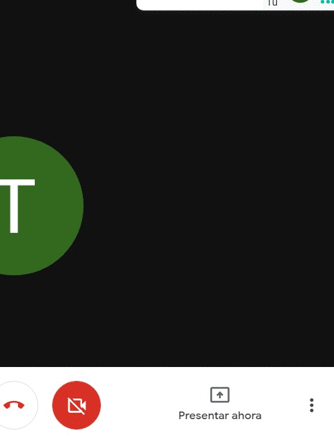

1.  La opción Grabar la reunión nos permite grabar la videoconferencia, aparecerá el siguiente mensaje, advirtiendo que la grabación de la reunión puede ser ilegal sin el consentimiento de los participantes.

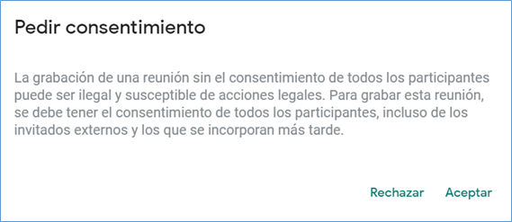

Podemos utilizar esta opción para grabar nuestras propias explicaciones, basta con hacer una reunión en la que no invites a nadie más y pulses la opción grabar reunión, puedes utilizar durante la grabación la opción compartir pantalla para explicar una presentación, vídeo,....

Cuando hayas finalizado, pulsa de nuevo en los tres puntos y después en Detener grabación. El video quedará guardado tras unos instantes en una carpeta que se habrá creado automáticamente en tu Unidad de Drive llamada Meet Recordings

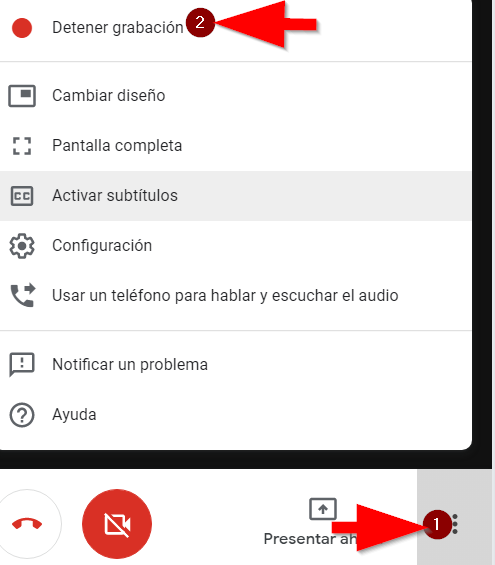

Según el reglamento de protección de datos actual, tanto la voz como la imagen son datos personales. En el ámbito educativo, es legal que un profesor grabe una reunión virtual dentro de su labor educativa, por ejemplo para valorar la pronunciación de sus alumnos en la clase de lengua extranjera, sin necesidad de solicitar consentimiento explícito y siempre que no sea difundido públicamente y sea custodiado por el profesor/a.

No es legal que el alumnado grabe una videoconferencia salvo consentimiento expreso de todos los participantes, profesores y alumnado. No obstante GSUITE permite, y es totalmente aconsejable, que los alumnos no tengan disponible la opción de grabar una videollamada.

Este es un ejemplo de normas que desde un Centro educativo público de Zaragoza han dado al alumnado de cara a participar en reuniones virtuales.

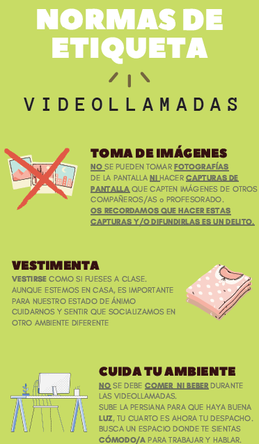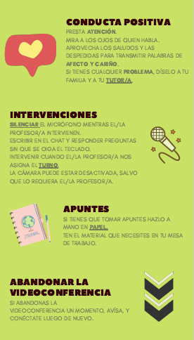

1.  La opción cambiar diseño permite modificar la distribución de los asistentes en la pantalla, podemos optar por un diseño en forma de mosaico, barra lateral,...

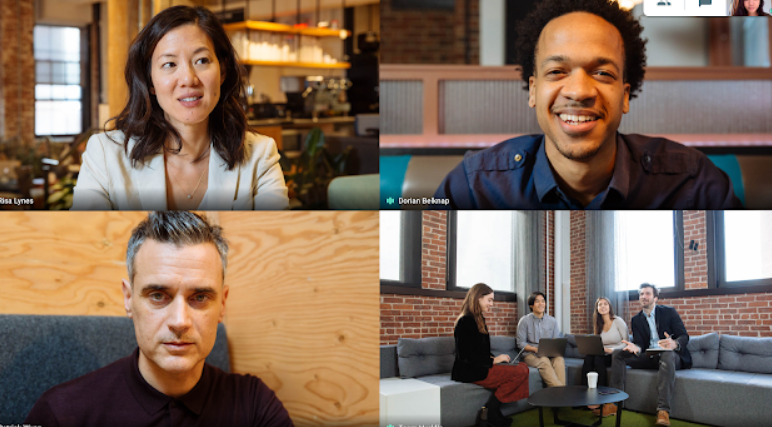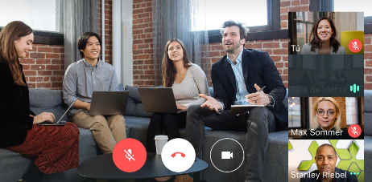

Fuente: [https://gsuiteupdates-es.googleblog.com/](https://www.google.com/url?q=https://gsuiteupdates-es.googleblog.com/&sa=D&ust=1585136093900000)

1.  La opción activar subtítulos solo está disponible en inglés, y escribe simultáneamente lo que los distintos interlocutores están exponiendo.

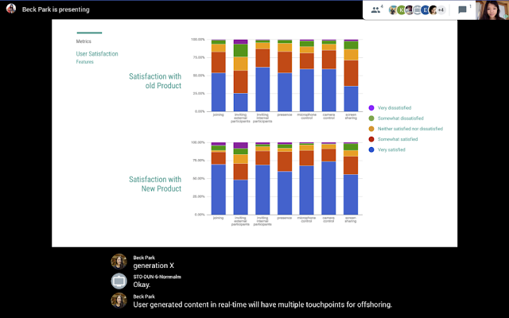

Fuente: [https://gsuiteupdates-es.googleblog.com/](https://www.google.com/url?q=https://gsuiteupdates-es.googleblog.com/&sa=D&ust=1585136093901000)

Por último, en la parte superior de la pantalla, verás el número de personas conectadas y el icono del chat, pulsando sobre él podrás desplegar el chat para llevar a cabo una conversación de texto. 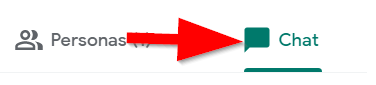