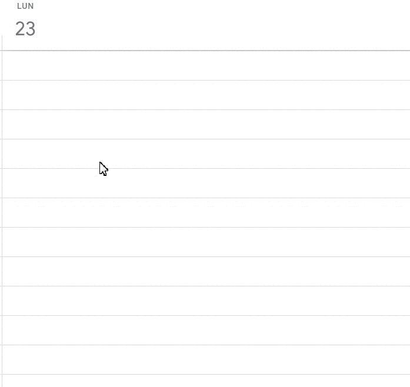
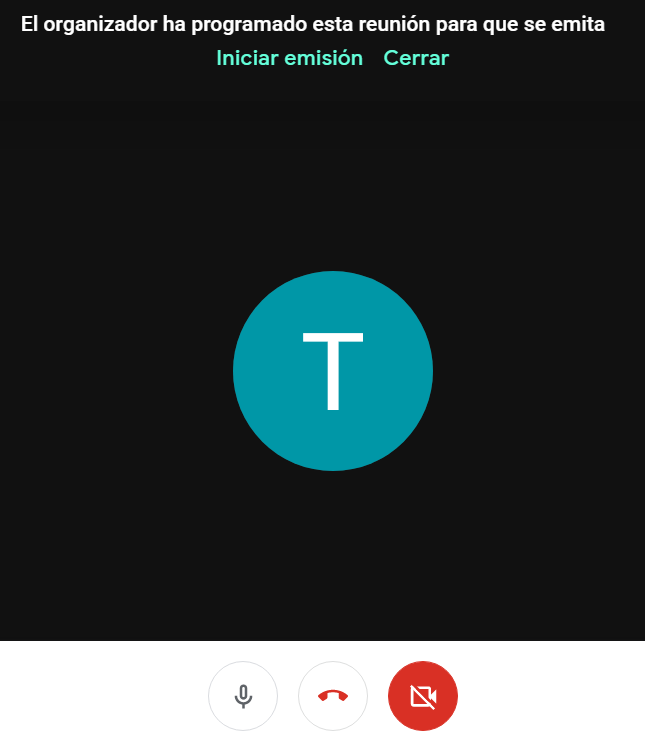
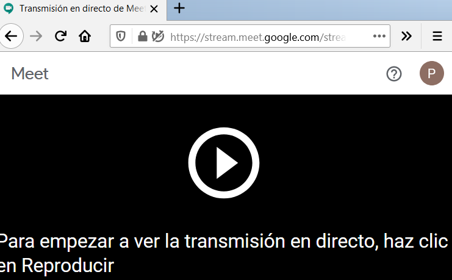
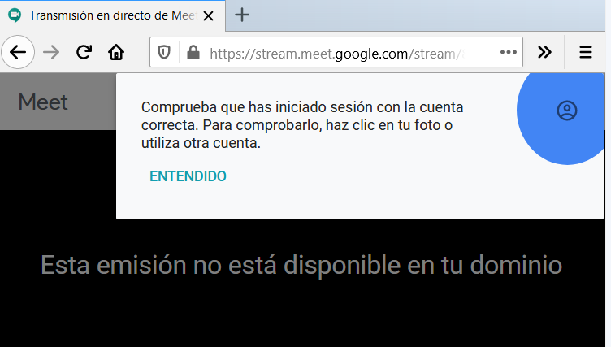
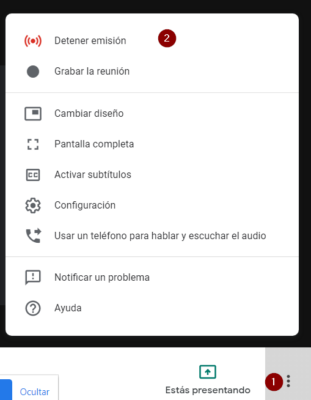

### Capítulo 4\. Emisiones en directo, streaming con Hangouts meet. {#cap-tulo-4-emisiones-en-directo-streaming-con-hangouts-meet}

Desee Meet se puede hacer streaming o emitir en directo. solo las personas que tengan cuenta corporativa de tu centro, podrán ver las emisiones en directo que hagas .

Los pasos son los siguientes, abre [Google Calendar](https://www.google.com/url?q=https://calendar.google.com/&sa=D&ust=1585136093908000) en tu ordenador

1.  En la esquina superior izquierda, haz clic en Crear  para crear un evento el día y hora que tengas pensado hacer la emisión.
2.  Clic en Añadir ubicación o conferencias  Añadir conferencia  Hangouts Meet.
3.  Junto a &quot;Unirse a Hangouts Meet&quot;, haz clic en la flecha hacia abajo  Añadir emisión en directo.
4.  Opcional: Para copiar la URL de la emisión, haz clic en Copiar  Listo.
5.  Haz clic en Guardar, para guardar el evento.

Ahora ya puedes pegar el enlace del streaming en un correo y enviarlo a las personas que tengan cuenta corporativa para que puedan ver la emisión en directo. En la siguiente imagen puedes ver el proceso completo.

Nota: Si no ves la opción para añadir una emisión en directo, es posible que la función no esté disponible en tu empresa u organización.

[https://support.google.com/calendar/answer/72143#live_stream](https://www.google.com/url?q=https://support.google.com/calendar/answer/72143%23live_stream&sa=D&ust=1585136093909000)

Para iniciar la emisión en directo, como organizador del evento debes unirte al enlace de la videoconferencia meet.google.com/uou-iipu-ouq y pulsar en Iniciar emisión  

Cualquier persona que tenga cuenta corporativa en tu Centro, podrá visualizar la retransmisión en directo  sin más que pegar en el navegador el enlace que le has enviado del streaming [https://stream.meet.google.com/stream/8fd2eea3-3897-](https://www.google.com/url?q=https://stream.meet.google.com/stream/8fd2eea3-3897-4556-b233-efc5a5b9&sa=D&ust=1585136093910000). ⇓

Si la persona no tiene cuenta corporativa de tu centro, aunque tenga el enlace del streaming no podrá ver la emisión en directo.⇓

El organizador puede detener la emisión en directo de la videoconferencia siguiendo los pasos 1 y 2 de la siguiente imagen, después puede abandonar la sala de la videoconferencia.

Nota la diferencia entre una reunión virtual en la que todas las personas invitadas a la sala pueden intervenir con imagen, voz, chat… en la reunión, mientras que las personas invitadas a este evento por streaming no participan con la cámara ni con el micrófono en la reunión, y tampoco pueden mostrar su pantalla, solo pueden visualizarlo.