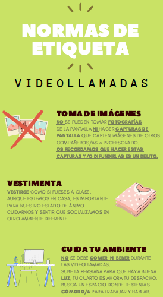

## Unidad 1\. Videollamadas con Hangouts Meet {#unidad-1-videollamadas-con-hangouts-meet}

### Capítulo 0\. Reuniones virtuales, algunas ideas iniciales {#cap-tulo-0-reuniones-virtuales-algunas-ideas-iniciales}

Es claro que una reunión virtual no equivale a una reunión presencial, la interacción con las personas no es la misma que en una reunión presencial. Tienen una serie de ventajas, y más en la actual situación ,  a las que podemos sacar partido a la hora de mantener contacto con el profesorado y alumnado de tu centro. hacer un seguimiento.

Algunos ejemplos de reuniones virtuales

*   Comunicación con uno o varios miembros de tu centro.
*   Celebración de reuniones de tutores, departamento,...
*   Clase de resolución de dudas del alumnado.
*   Tutoría individualizada.
*   Clase a todo el grupo….

Es importante que tengas en cuenta que la intensidad de una reunión virtual, en general, es mayor que durante una clase presencial, los medios tecnológicos por muy perfeccionados que estén no son transparentes, hay interferencias, estudiantes que no saben manejar el entorno, interrupciones, menor cercanía física y emocional… por lo que debes tener en cuenta lo siguiente:

*   Planifica la reunión con antelación, prueba el entorno y asegúrate que el alumnado lo conoce. Un buen ejercicio previo es que hagan reuniones virtuales entre ellos mismos.
*   Coordinate con el resto de profesorado del grupo para evitar que tengan un exceso de reuniones virtuales el mismo día. No se puede pretender que el alumnado tenga el mismo horario de videoconferencias que el presencial.
*   Ten a mano los documentos ( presentaciones, vídeos, pdf,...) que vayas a presentar a los alumnos, pero no se los envíes durante la reunión para evitar distracciones.
*   Decide si quieres que la reunión sea con imagen y sonido, solo con sonido, si mostrarás al principio las imágenes pero luego las ocultarás,….
*   Intenta que no haya ruidos en la sala donde te encuentres.
*   Envia a tus estudiantes unas normas sobre cómo actuar durante una videoconferencia. En [este enlace puedes ver las normas que un centro de Zaragoza](https://www.google.com/url?q=https://drive.google.com/file/d/18tz6Tgek2t_EkjuBx1PYzXn6iEue9qs2/view?usp%3Dsharing&sa=D&ust=1585136093881000) ha enviado a su alumnado de cara a participar en una videoconferencia.

